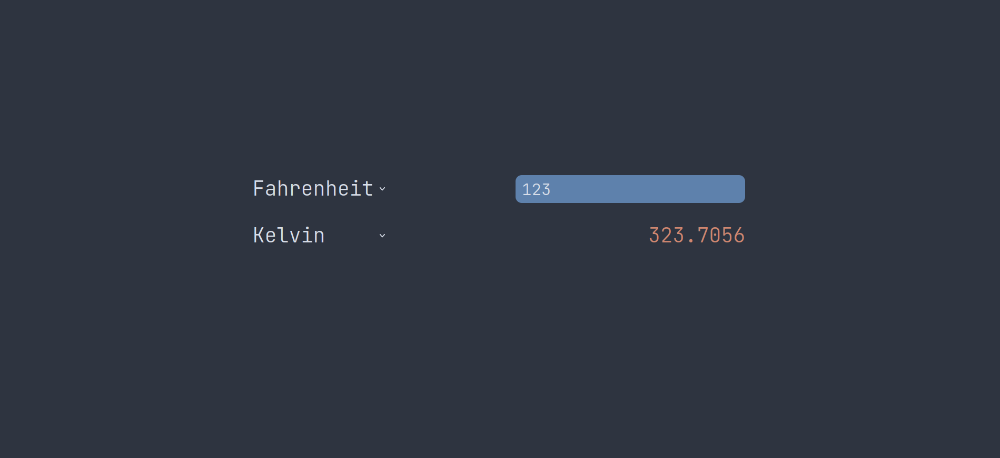

# Temperature converter in JavaScript
This is my first JavaScript project. It is a solution to the coding challenge from the set of programming challenges that I'm currently working on.

## Usage
Clone the project, then open the `index.html` file like this:

```bash
xdg-open index.html
```

## Features
This converter can convert to and from Fahrenheit, Celsius and Kelvin. It has (barely) responsive CSS stylesheet. The UI looks like this:

